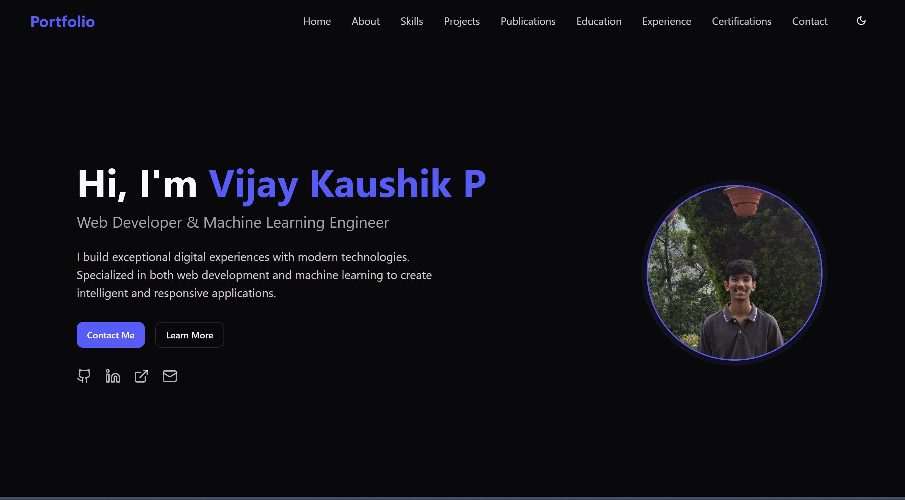

# Portfolio

This is a personal portfolio website built with React, TypeScript, and Tailwind CSS. It showcases various sections such as About, Skills, Projects, Experience, Education, Certifications, and more. The project uses Vite as the build tool for fast development and optimized production builds.

## Features

- Responsive design with Tailwind CSS
- Multiple sections including About, Skills, Projects, Experience, Education, Certifications, Publications, and Contact
- Dark mode toggle support
- Interactive UI components built with reusable React components
- Easy to customize and extend
- Mobile friendly layout

## Tech Stack

- React
- TypeScript
- Tailwind CSS
- Vite
- React Context API for theme management

## Folder Structure

- `src/components`: Reusable UI components and sections of the website
- `src/context`: React context for theme management
- `src/hooks`: Custom React hooks
- `src/lib`: Utility functions
- `src/pages`: Page components
- `public`: Static assets like images and icons

## 📸 Screenshots

